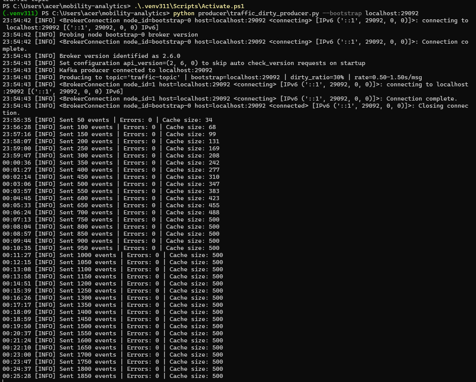
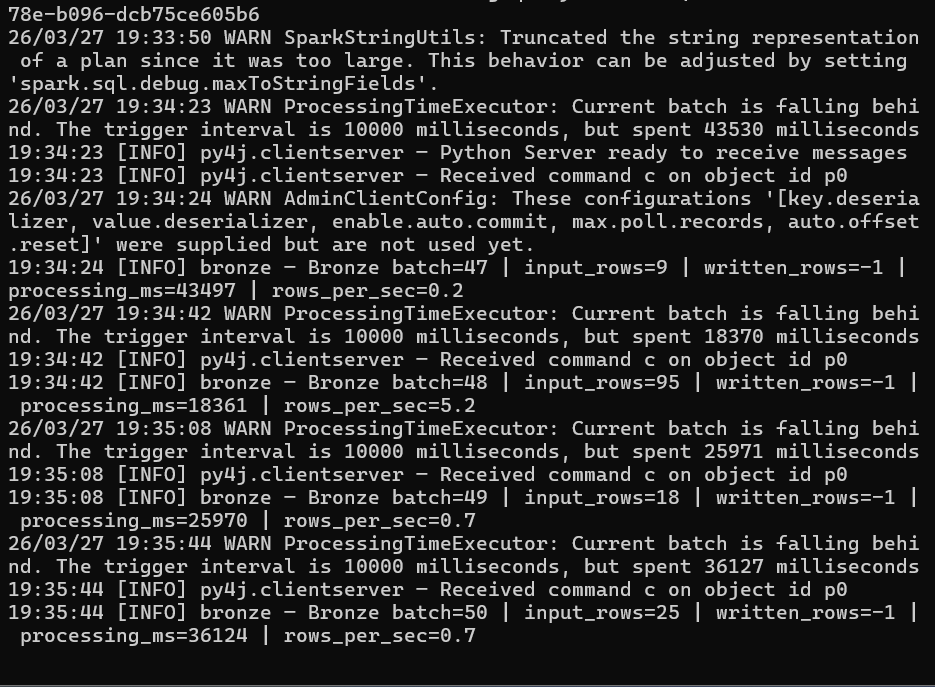
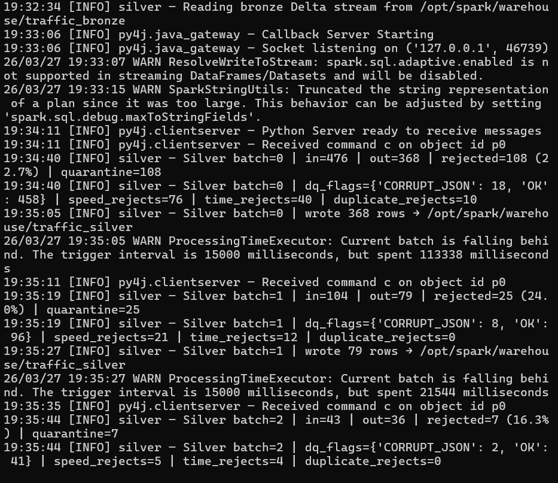
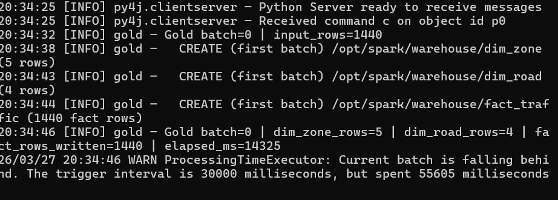
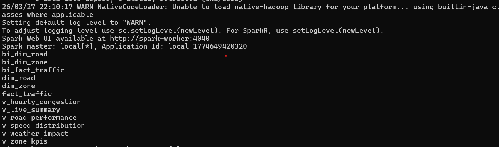
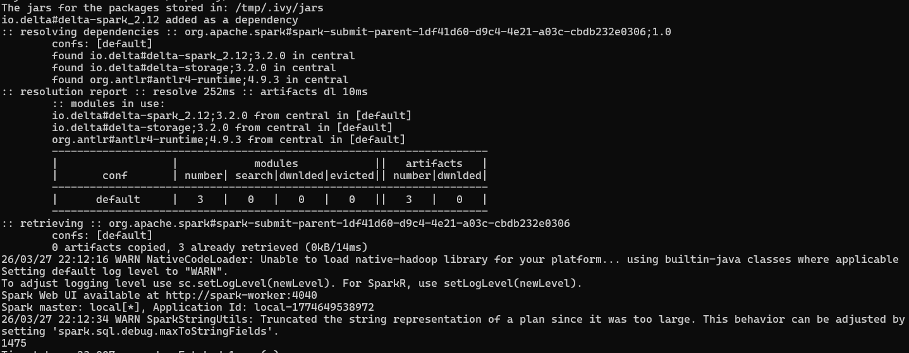
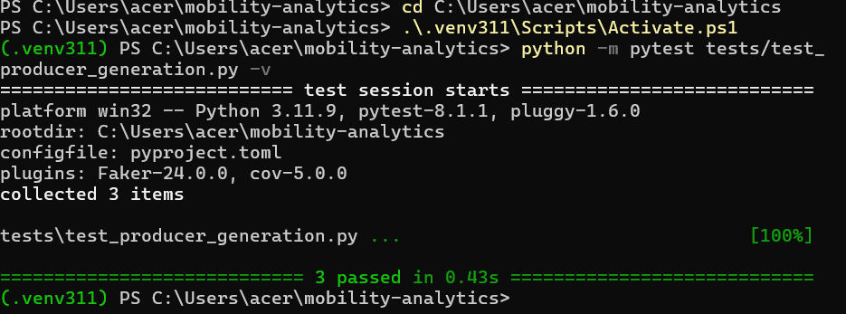
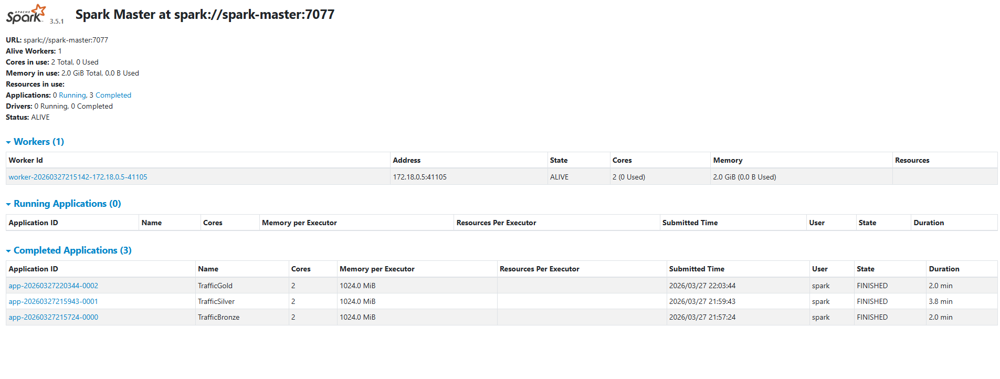
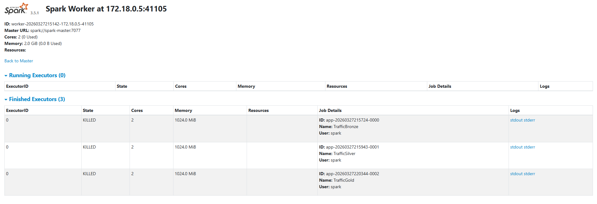
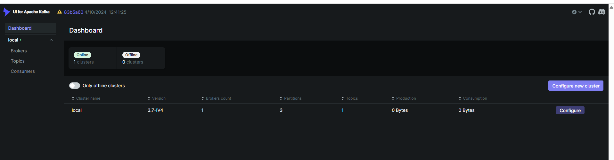

# Mobility Analytics Streaming Pipeline

[](https://github.com/Ayushgithubcodebasics/mobility-analytics-streaming-pipeline/actions/workflows/ci.yml)


End-to-end **real-time traffic analytics pipeline** — a Python Kafka producer streams 1,800+ dirty events per run into Spark Structured Streaming, which processes them through a Bronze → Silver → Gold medallion architecture backed by Delta Lake, registers a star schema in Hive Metastore, and exposes six BI-ready analytics views for Power BI consumption. Fully containerized, tested, and CI-gated.

---

## Architecture


**Data flow:** `Python Producer` → `Kafka (3 partitions)` → `Spark Structured Streaming` → `Delta Lake Medallion` → `Hive Metastore` → `Power BI`

---

## Tech Stack

| Component | Technology | Version |
|---|---|---|
| Event producer | Python + kafka-python | 3.11 |
| Message broker | Apache Kafka (KRaft, no ZooKeeper) | 3.7.1 |
| Stream processing | PySpark Structured Streaming | 3.5.1 |
| Storage format | Delta Lake | 3.2.0 |
| Catalog | Apache Hive Metastore | 3.1.3 |
| Metastore backend | PostgreSQL | 13 |
| Infrastructure | Docker Compose | 6 services |
| Testing | Pytest + Ruff | 8.1.1 / latest |
| CI | GitHub Actions | — |

---

## Pipeline — What Each Layer Does

### Producer (`producer/traffic_dirty_producer.py`)
- Generates synthetic traffic events at **0.5–1.5 s/msg** with a **30% dirty ratio**
- Injects **9 distinct fault types**: `null_speed`, `negative_speed`, `extreme_speed`, `duplicate_event`, `late_event`, `future_event`, `wrong_datatype`, `schema_drift`, `corrupt_json`
- Maintains an LRU **event cache of 500 entries** for realistic duplicate injection
- Connects to Kafka at `localhost:29092` (host-mapped) and produces to `traffic-topic`

### Bronze (`apps/traffic_bronze.py`) — Raw Ingestion
- Subscribes to `traffic-topic` via Spark Structured Streaming with **10-second micro-batches**
- Preserves Kafka metadata: `kafka_timestamp`, `kafka_partition`, `kafka_offset`
- Writes raw JSON records to Delta Lake at `/opt/spark/warehouse/traffic_bronze` — **no cleaning applied**
- Checkpoints offsets so restarts resume exactly where the job left off (`failOnDataLoss=false`)
- `speed` and `event_time` stay as `StringType` intentionally — dirty events inject non-numeric strings that must survive Bronze for auditability

### Silver (`apps/traffic_silver.py`) — Data Quality + Cleaning
Five-stage DQ pipeline executed per micro-batch via `foreachBatch`:

| Stage | Function | What it does |
|---|---|---|
| 1 | `apply_dq_flags` | Attaches `dq_flag` — `CORRUPT_JSON`, `MISSING_VEHICLE`, `MISSING_TIME`, `MISSING_CONGESTION`, or `OK` |
| 2 | `apply_type_casting` | Casts `speed` (String→Int, non-numeric → null) and `event_time` (ISO-8601→Timestamp, malformed → null) |
| 3 | `apply_business_validation` | Speed range check (0–160 km/h), timestamp window check (−20 min / +10 min from now) |
| 4 | `filter_clean_records` + dedup | Drops all rejected rows; deduplicates on `(vehicle_id, event_ts)` using a window function |
| 5 | `apply_feature_engineering` | Derives `hour`, `peak_flag`, `speed_band` for analytics |

Rejected records (including duplicates) are quarantined to `/opt/spark/warehouse/traffic_rejects` with a `reject_reason` column. Live rejection rate in the observed run was **22–25%**.

### Gold (`apps/traffic_gold.py`) — Star Schema
- Reads the Silver Delta stream with **30-second micro-batches**
- Builds and upserts three Delta tables using **`DeltaTable.merge()` — idempotent, safe to rerun**:
  - `dim_zone` — 5 rows: zone type (`Commercial`, `IT Hub`, `Transit Hub`, `Residential`) + traffic risk (`HIGH`/`MEDIUM`/`LOW`)
  - `dim_road` — 4 rows: road type (`Highway` vs `City Road`) + speed limit
  - `fact_traffic` — **1,475 rows** loaded from a single live streaming run; merge key is `(vehicle_id, road_id, city_zone, event_ts)`

### Hive Metastore + BI Views
Six analytics views registered in Hive and queryable via Spark SQL / Thrift Server:

| View | Purpose |
|---|---|
| `v_live_summary` | Real-time aggregate counts and average speed |
| `v_hourly_congestion` | Congestion level distribution by hour |
| `v_road_performance` | Average speed and vehicle count per road |
| `v_weather_impact` | Speed and congestion breakdown by weather condition |
| `v_speed_distribution` | Speed band frequency across the network |
| `v_zone_kpis` | Zone-level KPIs joining fact and dim_zone |

---

## Pipeline Execution Evidence

---

### Kafka Producer — Streaming Traffic Events to Topic



Python producer connected to `localhost:29092`, sending events to `traffic-topic` at 0.5–1.5s/msg with 30% dirty ratio. 1,850+ events sent with 0 errors and event cache capped at 500.

---

### Bronze Layer — Raw Kafka Events Landing in Delta Lake



Spark Structured Streaming consuming from Kafka with 10-second micro-batches. Raw JSON records written to Delta Lake at `/opt/spark/warehouse/traffic_bronze` with no transformation applied.

---

### Silver Layer — DQ Validation, Quarantine, Feature Engineering



Five-stage DQ pipeline running per micro-batch via `foreachBatch`. Batch 0: 476 records in → 368 clean → 108 quarantined (22.7%). Reject breakdown logged per batch: `CORRUPT_JSON`, speed rejects, time rejects, duplicates.

---

### Gold Layer — Dimensional Model Loaded via Delta MERGE



Gold batch 0 created `dim_zone` (5 rows), `dim_road` (4 rows), and `fact_traffic` (1,440 rows) using `DeltaTable.merge()` — idempotent upserts safe to rerun from checkpoint.

---

### Hive Metastore — All Delta Tables and BI Views Registered



All 3 Delta tables (`dim_zone`, `dim_road`, `fact_traffic`) and 6 analytics views (`v_live_summary`, `v_hourly_congestion`, `v_road_performance`, `v_weather_impact`, `v_speed_distribution`, `v_zone_kpis`) registered and queryable via Spark SQL / Thrift Server.

---

### fact_traffic — 1,475 Rows from Live Streaming Pipeline



`fact_traffic` row count confirmed via Spark SQL after a full pipeline run. Merge key: `(vehicle_id, road_id, city_zone, event_ts)` — no duplicates.

---

### Unit Tests Passing



3 unit tests passing in 0.43s on Python 3.11, pytest 8.1.1. All Silver DQ transformation functions tested in isolation — no Docker, no Kafka, no Delta required.

---

### Spark Master UI



Spark 3.5.1 cluster: 1 worker, 2 cores, 2 GiB memory. 3 completed applications — `TrafficBronze`, `TrafficSilver`, `TrafficGold` — all finished successfully.

---

### Spark Worker UI



Single worker at `172.18.0.5:41105` showing 3 finished executors for Bronze, Silver, and Gold jobs. Each executor allocated 2 cores and 1,024 MiB.

---

### Kafka UI — traffic-topic



Kafka 3.7-IV4 cluster online. 1 broker, 3 partitions, `traffic-topic` active. KRaft mode — no ZooKeeper dependency.

---

---

## Repository Structure

```
mobility-analytics-streaming-pipeline/
├── apps/
│   ├── config.py               # All env-var-driven runtime config (no hardcoded values)
│   ├── silver_transforms.py    # Pure DQ functions — no side effects, fully unit-testable
│   ├── traffic_bronze.py       # Bronze streaming job
│   ├── traffic_silver.py       # Silver streaming job with foreachBatch DQ
│   └── traffic_gold.py         # Gold streaming job with Delta MERGE upserts
├── producer/
│   └── traffic_dirty_producer.py  # Kafka producer — 9 fault types, 30% dirty ratio
├── sql/
│   ├── create_tables.sql       # External Delta table DDL for Hive registration
│   └── analytics_views.sql     # 6 BI views: congestion, weather, zone KPIs, etc.
├── scripts/
│   ├── register_views.sql      # One-shot Hive registration script
│   └── run_local_demo.ps1      # PowerShell bootstrap for local setup
├── tests/
│   ├── conftest.py             # Shared local Spark session fixture
│   ├── test_producer_generation.py  # Producer event shape tests
│   └── test_silver_dq.py       # Silver DQ function tests
├── docs/
│   └── screenshots/            # Live run evidence (12 screenshots)
├── hive-conf/
│   └── hive-site.xml           # Hive → PostgreSQL metastore configuration
├── .github/workflows/ci.yml    # GitHub Actions: lint + test on push and PR
├── docker-compose.yml          # 6-service stack: Kafka, Spark, Hive, PostgreSQL, Kafka UI
├── .env.example                # Environment variable template
├── pyproject.toml              # Ruff + pytest config
└── requirements.txt            # Python dependencies
```

---

## Docker Services

```
docker-compose.yml (6 services)
├── postgres-metastore   PostgreSQL 13        → port 5435   (Hive metastore backend)
├── hive-metastore       Apache Hive 3.1.3    → port 9083   (Thrift server)
├── spark-master         Spark 3.5.1          → port 7077   (cluster manager)
├── spark-worker         Spark 3.5.1          → port 4040   (executor + driver)
├── kafka                Kafka 3.7.1 KRaft    → port 29092  (host-mapped)
└── kafka-ui             Provectus Kafka UI   → port 8085
```

---

## Quick Start

### Prerequisites
- Docker Desktop running
- Python 3.11 (for the producer and tests)
- Windows PowerShell (commands below) or adapt for bash

### 1. Clone and activate environment

```powershell
git clone https://github.com/Ayushgithubcodebasics/mobility-analytics-streaming-pipeline.git
cd mobility-analytics-streaming-pipeline
py -3.11 -m venv .venv311
.\.venv311\Scripts\Activate.ps1
pip install -r requirements.txt
```

### 2. Configure environment

```powershell
Copy-Item .env.example .env
# First run: keep HIVE_IS_RESUME=false
# Subsequent restarts: set HIVE_IS_RESUME=true
```

### 3. Start the stack

```powershell
docker compose up -d
```

### 4. Create the Kafka topic

```powershell
docker exec -it kafka /opt/kafka/bin/kafka-topics.sh `
  --create --topic traffic-topic `
  --bootstrap-server kafka:9092 `
  --partitions 3 --replication-factor 1
```

### 5. Run the producer (Terminal 1)

```powershell
python producer\traffic_dirty_producer.py --bootstrap localhost:29092
```

### 6. Run the streaming jobs (Terminals 2, 3, 4)

```powershell
# Bronze
docker exec -it spark-worker /opt/spark/bin/spark-submit `
  --conf spark.jars.ivy=/tmp/.ivy `
  --packages io.delta:delta-spark_2.12:3.2.0,org.apache.spark:spark-sql-kafka-0-10_2.12:3.5.1 `
  /opt/spark-apps/traffic_bronze.py

# Silver
docker exec -it spark-worker /opt/spark/bin/spark-submit `
  --conf spark.jars.ivy=/tmp/.ivy `
  --packages io.delta:delta-spark_2.12:3.2.0,org.apache.spark:spark-sql-kafka-0-10_2.12:3.5.1 `
  /opt/spark-apps/traffic_silver.py

# Gold
docker exec -it spark-worker /opt/spark/bin/spark-submit `
  --conf spark.jars.ivy=/tmp/.ivy `
  --packages io.delta:delta-spark_2.12:3.2.0,org.apache.spark:spark-sql-kafka-0-10_2.12:3.5.1 `
  /opt/spark-apps/traffic_gold.py
```

### 7. Register Hive tables and views

```powershell
# Follow commands.txt for the full manual flow, or run:
docker exec -it spark-worker /opt/spark/bin/spark-sql -f /opt/spark-apps/../scripts/register_views.sql
```

---

## Testing

```powershell
# Linting
python -m ruff check apps tests

# Unit tests (no Docker required — runs against a local Spark session)
python -m pytest tests -v
```

All DQ transformation functions in `silver_transforms.py` are pure (no Spark session, no file I/O, no side effects) — they are designed to be tested in isolation. The `conftest.py` fixture spins up a local Spark session and tears it down after the test suite.

GitHub Actions runs linting and the full test suite on every push and pull request.

---

## Key Design Decisions

**Why `foreachBatch` in Silver and Gold instead of native streaming writes?**
`foreachBatch` gives full DataFrame API access inside each micro-batch — required for multi-pass DQ logic (count, cache, filter, union, write quarantine, write clean) that is not expressible in a single streaming write.

**Why Delta MERGE in Gold instead of append?**
Idempotency. If a Gold job crashes mid-batch and restarts from checkpoint, the MERGE prevents duplicate fact rows — a plain append would double-count every record in the replayed batch.

**Why are `speed` and `event_time` `StringType` in Bronze?**
The dirty producer injects string values like `"FAST"` and `"SLOW"` for speed. Casting to `IntegerType` at Bronze would silently null those records before they are stored, destroying audit trail. Bronze is a raw landing zone — Silver is where types are enforced.

**Why is the Kafka `group.id` not set in the Spark consumer?**
Spark Structured Streaming manages Kafka offsets via its own checkpoint mechanism. Setting `kafka.group.id` causes consumer group offset conflicts that silently block ingestion. The offset management is internal and explicit via `checkpointLocation`.

---

## Environment Variables (`.env`)

| Variable | Default | Description |
|---|---|---|
| `SPARK_MASTER_URL` | `spark://spark-master:7077` | Spark cluster master |
| `KAFKA_BOOTSTRAP_SERVERS` | `kafka:9092` | Internal Kafka address |
| `KAFKA_TOPIC` | `traffic-topic` | Topic name |
| `MAX_OFFSETS_PER_TRIGGER` | `2000` | Per-batch Kafka read cap |
| `BRONZE_TRIGGER_INTERVAL` | `10 seconds` | Bronze micro-batch interval |
| `SILVER_TRIGGER_INTERVAL` | `15 seconds` | Silver micro-batch interval |
| `GOLD_TRIGGER_INTERVAL` | `30 seconds` | Gold micro-batch interval |
| `SPEED_MAX_KMH` | `160` | Silver speed validation ceiling |
| `LATE_EVENT_MINUTES` | `20` | Max event age before rejection |
| `FUTURE_EVENT_MINUTES` | `10` | Max event lead time before rejection |
| `HIVE_IS_RESUME` | `false` | Set to `true` after first successful Hive init |

---

## License

MIT — see [LICENSE](LICENSE)
