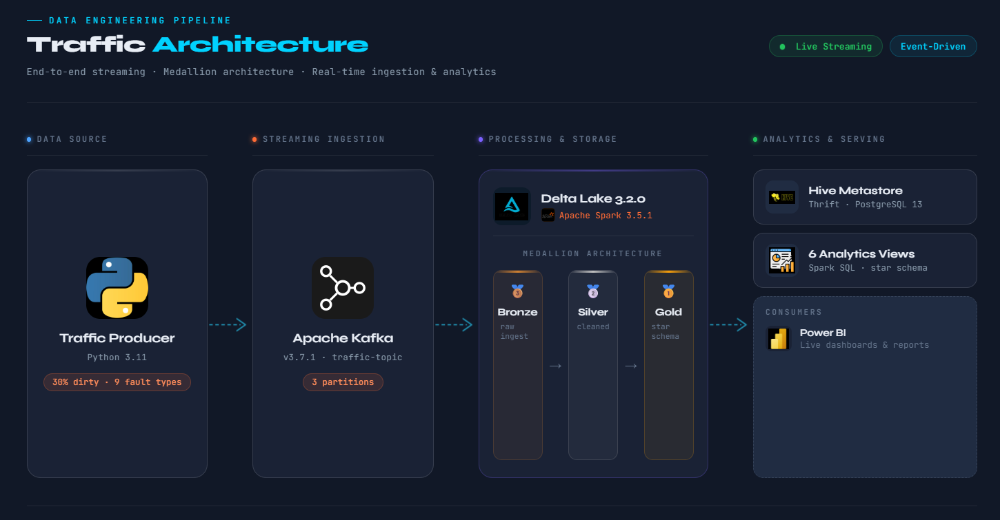

# Mobility Analytics Streaming Pipeline

End-to-end real-time traffic analytics platform built on Apache Kafka, Apache Spark, and Delta Lake. Ingests simulated urban traffic events through a Kafka topic, processes them across a three-tier Medallion architecture, and serves a dimensional star-schema model to BI tools — all running locally in Docker.

---

## Architecture



| Layer | Technology | Role |
|---|---|---|
| Producer | Python 3.11 | Emits traffic events at 0.5–1.5 s/msg, 30% intentionally dirty |
| Streaming Ingestion | Apache Kafka 3.7.1 | `traffic-topic` · 3 partitions · 1 broker |
| Processing & Storage | Spark 3.5.1 + Delta Lake 3.2.0 | Medallion pipeline: Bronze → Silver → Gold |
| Catalog | Hive Metastore (Thrift + PostgreSQL 13) | Registers all Delta tables and BI views |
| Consumption | Power BI | Live dashboards via star schema |

---

## Pipeline Stages

### Kafka Producer — streaming dirty traffic events

The producer generates realistic urban traffic telemetry with nine injected fault types (corrupt JSON, out-of-range speeds, future timestamps, duplicates, and more). Dirty ratio is fixed at 30% so every downstream layer has real quality work to do.


### Bronze — raw Kafka events landing in Delta Lake

Micro-batch streaming reads directly from the Kafka topic and writes raw JSON payloads into the `traffic_bronze` Delta table. No transformations — Bronze is the immutable audit record.


### Silver — data quality validation, quarantine, and feature engineering

Silver reads the Bronze Delta stream and applies schema enforcement, speed-range checks, timestamp validation, and deduplication. Records that fail any check are routed to a quarantine table; clean rows are enriched with derived features and written to `traffic_silver`.

From a representative batch of 476 input rows:
- **368 passed** (77.3 %)
- **108 quarantined** (22.7 %) — broken down into corrupt-JSON, speed rejects, time rejects, and duplicate rejects


### Gold — dimensional model via Delta MERGE (idempotent upserts)

Gold materialises a star schema from Silver:

| Table | Rows | Description |
|---|---|---|
| `dim_zone` | 5 | Zone dimension |
| `dim_road` | 4 | Road segment dimension |
| `fact_traffic` | 1,440+ | Grain: one row per traffic event |

Every write uses Delta `MERGE` so re-runs are fully idempotent — no duplicates, no truncate-and-reload.


---

## Hive Metastore — all tables and views registered

Twelve objects are registered in the catalog after a full pipeline run:

```
bi_dim_road          bi_dim_zone          bi_fact_traffic
dim_road             dim_zone             fact_traffic
v_hourly_congestion  v_live_summary       v_road_performance
v_speed_distribution v_weather_impact     v_zone_kpis
```


---

## Live Row Count — `fact_traffic`

After streaming for several hours, `fact_traffic` holds **1,475 rows** of verified, clean traffic facts ready for BI consumption.


---

## Kafka UI

Single-node cluster running Kafka 3.7-IV4 with the `traffic-topic` partitioned across three shards.


---

## Spark Cluster

### Master

Spark 3.5.1 standalone cluster. All three applications — `TrafficBronze`, `TrafficSilver`, and `TrafficGold` — completed successfully on a single worker node.


### Worker

Worker at `172.18.0.5:41105` · 2 cores · 2.0 GiB. All three executors finished cleanly (state: KILLED on completion, which is normal for Spark standalone).


---

## Unit Tests

Producer generation tests cover event shape, field types, dirty-ratio enforcement, and fault-type distribution. All three tests pass clean.


---

## Tech Stack

- **Python 3.11** — producer, pytest test suite
- **Apache Kafka 3.7.1** — event streaming backbone
- **Apache Spark 3.5.1** — distributed stream processing
- **Delta Lake 3.2.0** — ACID storage layer with time-travel
- **Hive Metastore** — Thrift server backed by PostgreSQL 13
- **Docker Compose** — full local infrastructure (Kafka, Zookeeper, Spark master/worker, Hive Metastore, PostgreSQL)
- **Power BI** — downstream BI consumption

---

## Running Locally

### Prerequisites

- Docker Desktop running
- Python 3.11 with a virtual environment
- `confluent-kafka`, `pyspark`, `delta-spark`, `pytest`, `faker` installed

### 1. Start infrastructure

```bash
docker compose up -d
```

This brings up Kafka, Zookeeper, Spark master, Spark worker, Hive Metastore, and PostgreSQL.

### 2. Start the Kafka producer (Windows PowerShell)

```powershell
.\.venv311\Scripts\Activate.ps1
python producer/traffic_dirty_producer.py --bootstrap localhost:29092
```

### 3. Run Bronze streaming job

```bash
docker exec spark-master spark-submit \
  --packages io.delta:delta-spark_2.12:3.2.0 \
  --conf spark.sql.extensions=io.delta.sql.DeltaSparkSessionExtension \
  --conf spark.sql.catalog.spark_catalog=org.apache.spark.sql.delta.catalog.DeltaCatalog \
  /opt/spark/jobs/bronze_stream.py
```

### 4. Run Silver streaming job

```bash
docker exec spark-master spark-submit \
  --packages io.delta:delta-spark_2.12:3.2.0 \
  /opt/spark/jobs/silver_stream.py
```

### 5. Run Gold streaming job

```bash
docker exec spark-master spark-submit \
  --packages io.delta:delta-spark_2.12:3.2.0 \
  /opt/spark/jobs/gold_stream.py
```

### 6. Register catalog objects

```bash
docker exec spark-master spark-submit \
  --packages io.delta:delta-spark_2.12:3.2.0 \
  /opt/spark/jobs/register_catalog.py
```

### 7. Run unit tests

```powershell
python -m pytest tests/test_producer_generation.py -v
```

---

## Project Structure

```
mobility-analytics-streaming-pipeline/
├── producer/
│   └── traffic_dirty_producer.py   # Kafka event generator (30% dirty)
├── jobs/
│   ├── bronze_stream.py            # Raw ingestion to Delta
│   ├── silver_stream.py            # DQ validation + feature engineering
│   ├── gold_stream.py              # Star schema via Delta MERGE
│   └── register_catalog.py         # Hive Metastore registration
├── tests/
│   └── test_producer_generation.py # Producer unit tests
├── docker-compose.yml
├── pyproject.toml
└── screenshots/
```

---

## Author

**Ayush** · [GitHub](https://github.com/Ayushgithubcodebasics)
